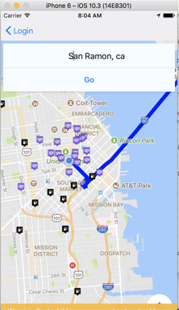
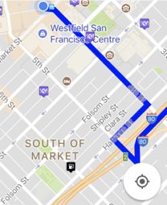
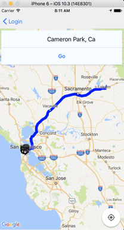

# Road Warriors

[Frontend is here](https://github.com/peanutenthusiast/RoadWarriors-Frontend)

## The Problem
They say it's not about the destination. It's about the journey. Yet, can you really enjoy your journey when you always need to pull up Yelp, Google Maps, Safari, and a whole lot of other windows that add road blocks to your seamless experience?

## The Solution
With the Road Warriors iOS app, you can reduce all those windows and apps to one. Get directions to your destination on the map. As you travel, Road Warriors dynamically displays markers for gasoline stations and restaurants so you don't have to do that research.

## How It Works
We implemented a variety of technologies including the Yelp Fusion API, Google Developers APIs, RoR, React-Native, Xcode, and Heroku, and AirBnb's react-native-maps library.

When a user enters their destination, the app makes an API call to the Backend, which obtains the polylines from the Google Directions API, and sends these polylines back to the front end. As the user traverses their route, the front end makes continuous API calls to the Rails back end, which in turn make API calls to the Yelp and Google Places APIs for restaurants and gasoline station results within a given radius around a user's current location. These sliced, parsed results are then returned over to the front end, which then displays these results as dynamic markers within the rendered map.

The schema also details the road map for future features, e.g. starring favorite places, saving routes, and appending pit stops to a final destination.

